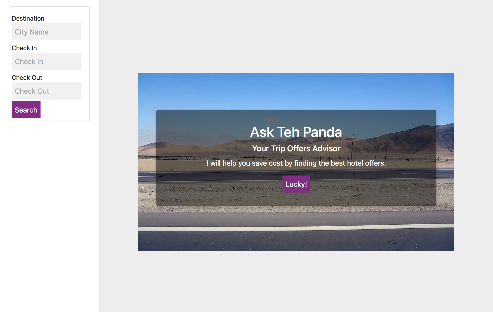

# Ask The Panda
## Introduction
Ask the panda is open source simple template for offers booking website that use Ajax to get information.<br/>
The website divide the page into control area and offers area that support big screens and small screens such as mobiles.<br/>

## Requirements
Download the required libraries for code using following terminal command:
- Import anaconda environment
```
cd requirements
conda env create -f websites.yml
soruce activate websites.yml
```
- OR install requirements directly in Python 3+ environment
```
cd requirements
pip install -r requirements.txt
```

if you don't have anaconda download from [here](https://anaconda.org/)

## Important classes
- CityLoader.py : Load list of popular cities to use it for autocomplete field
- OffersLoader.py: Connect to Expedia API to get list of offers based on params
- app.py: Main file that control all requests.

## How to use
1. Install requirements.
2. Open terminal and go to folder location.
3. Run following command to run the website:```python app.py```
4. In case of UI testing without internet go to app.py file and assign True to TESTING_MODE

## Examples
- Big screen:


- Small screen:


License
-------
    The MIT License (MIT)

    Copyright (c) 2017 Ahmad Barqawi (github.com/Barqawiz)

    Permission is hereby granted, free of charge, to any person obtaining a copy
    of this software and associated documentation files (the "Software"), to deal
    in the Software without restriction, including without limitation the rights
    to use, copy, modify, merge, publish, distribute, sublicense, and/or sell
    copies of the Software, and to permit persons to whom the Software is
    furnished to do so, subject to the following conditions:

    The above copyright notice and this permission notice shall be included in all
    copies or substantial portions of the Software.
